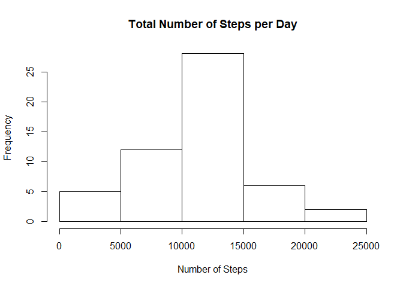
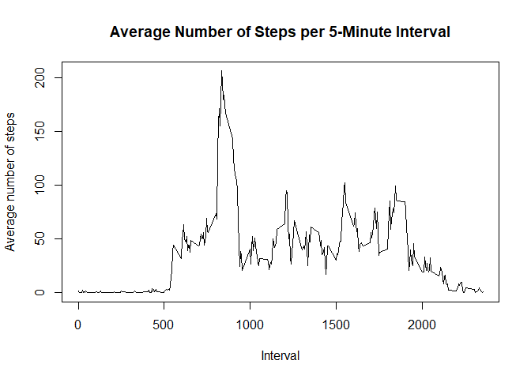
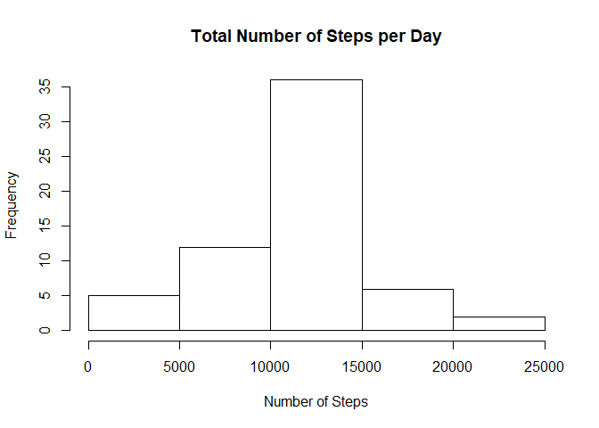
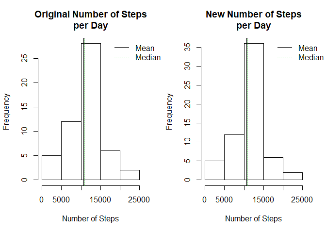
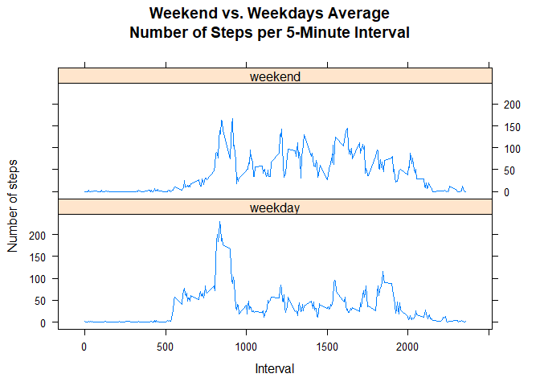

## Loading and preprocessing the data

Unzip the data file and load the resulting CSV file:


```r
unzip("activity.zip")
act_data <- read.csv("activity.csv")
```

Convert the `date` column from `Factor` to `Date` ant the `interval` column from `int` to `Factor`:


```r
act_data$date <- as.Date(act_data$date)
act_data$interval <- as.factor(act_data$interval)
```

## What is mean total number of steps taken per day?

Compute the total number of steps taken per day and plot the histogram:


```r
steps_per_day <- with(act_data, tapply(steps, date, sum))
hist(steps_per_day, xlab = "Number of Steps", main = "Total Number of Steps per Day")
```

<!-- -->

Mean an median of the total number of steps taken per day:


```r
mean(steps_per_day, na.rm = TRUE)
```

```
## [1] 10766.19
```

```r
median(steps_per_day, na.rm = TRUE)
```

```
## [1] 10765
```

## What is the average daily activity pattern?

Compute the average number of steps across all days, convert the resulting `numeric` vector to a `data frame`, and plot the average number of steps as a time series:


```r
interval_mean <- with(act_data, tapply(steps, interval, mean, na.rm = TRUE))
interval_mean <- as.data.frame(interval_mean)
interval_mean <- tibble::rownames_to_column(interval_mean, "Interval")
names(interval_mean) <- c("Interval", "Mean")

with(interval_mean, plot(Interval, Mean, type = "l", ylab = "Average number of steps", main = "Average Number of Steps per 5-Minute Interval"))
```

<!-- -->

Find the 5-minute interval with the maximum average number of steps:


```r
max_mean <- with(interval_mean, which(Mean == max(Mean)))
interval_mean[max_mean, "Interval"]
```

```
## [1] "835"
```

## Imputing missing values

Compute the total number of rows with missing values for each column in the dataset:


```r
colSums(is.na(act_data))
```

```
##    steps     date interval 
##     2304        0        0
```

Only the `steps` column has missing values, so the mean number of steps for each 5-minute interval can be used for filling in the missing values. The mean values were already computed and stored in the `interval_mean` data frame.

First, define a function for getting the mean number of steps for a given interval:


```r
get_mean <- function(x){
    interval_mean[with(interval_mean, which(Interval == x)), "Mean"]
}
```

Then make a copy of the original dataset, identify all the rows with missing values, and replace them with the corresponding mean value:


```r
act_filled <- act_data
na_rows <- is.na(act_filled$steps)
act_filled$steps[na_rows] <- mapply(get_mean, act_filled$interval[na_rows])
```

Confirm that no missing values were left in the new dataset:


```r
colSums(is.na(act_filled))
```

```
##    steps     date interval 
##        0        0        0
```

Histogram, mean and median for the new dataset:


```r
new_steps_per_day <- with(act_filled, tapply(steps, date, sum))
hist(new_steps_per_day, xlab = "Number of Steps", main = "Total Number of Steps per Day")
```

<!-- -->

```r
mean(new_steps_per_day)
```

```
## [1] 10766.19
```

```r
median(new_steps_per_day)
```

```
## [1] 10766.19
```

Plot the histograms for the old and new data side by side for comparison:


```r
par(mfrow = c(1,2))

hist(steps_per_day, xlab = "Number of Steps", main = "Original Number of Steps\nper Day")
abline(v=mean(steps_per_day, na.rm = TRUE), col = "black", lty = "solid", lwd = 2)
abline(v=median(steps_per_day, na.rm = TRUE), col = "green", lty = "dotted")
abline(v=median(new_steps_per_day), col = "green", lty = "dotted")
legend("topright", legend = c("Mean", "Median"), col = c("black", "green"), lty = c("solid", "dotted"), box.lty=0, inset=c(-0.2,0), xpd=TRUE)

hist(new_steps_per_day, xlab = "Number of Steps", main = "New Number of Steps\nper Day")
abline(v=mean(new_steps_per_day), col = "black", lty = "solid", lwd = 2)
abline(v=median(new_steps_per_day), col = "green", lty = "dotted")
legend("topright", legend = c("Mean", "Median"), col = c("black", "green"), lty = c("solid", "dotted"), box.lty=0, inset=c(-0.2,0), xpd=TRUE)
```

<!-- -->

In the new dataset, the frequency increases around the mean but the mean and median values don't change after imputing missing data.

## Are there differences in activity patterns between weekdays and weekends?

Create the factor variable `day_type` indicating whether a given date is a weekday or weekend day:


```r
act_filled$day_type <- as.factor(sapply(act_filled$date, function(x) if (weekdays(x) %in% c("Monday", "Tuesday", "Wednesday", "Thursday", "Friday")) {"weekday"} else {"weekend"}))
```

Using the `dplyr` library, group observations by interval and day type, then compute the average number of steps for each 5-minute interval accross all days, split by weekdays and weekends:


```r
library(dplyr)
classif_interv_mean <- group_by(act_filled, interval, day_type)
classif_interv_mean <- summarize(classif_interv_mean, avg_steps=mean(steps))
```

Take a look at the resulting data:


```r
head(classif_interv_mean, 10)
```

```
## # A tibble: 10 x 3
## # Groups:   interval [5]
##    interval day_type avg_steps
##    <fct>    <fct>        <dbl>
##  1 0        weekday    2.25   
##  2 0        weekend    0.215  
##  3 5        weekday    0.445  
##  4 5        weekend    0.0425 
##  5 10       weekday    0.173  
##  6 10       weekend    0.0165 
##  7 15       weekday    0.198  
##  8 15       weekend    0.0189 
##  9 20       weekday    0.0990 
## 10 20       weekend    0.00943
```

Plot the data using the `lattice` system:


```r
library(lattice)
with(classif_interv_mean, xyplot(avg_steps ~ as.numeric(as.character(interval)) | day_type, type = "l", layout = c(1,2), xlab = "Interval", ylab = "Number of steps", main = "Weekend vs. Weekdays Average\nNumber of Steps per 5-Minute Interval"))
```

<!-- -->
